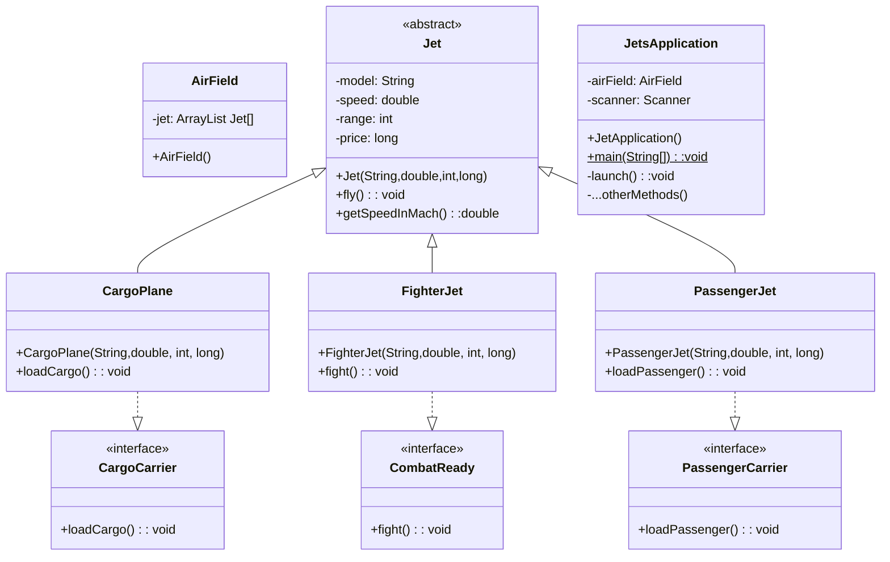

# JetsProject

### Description
This project applies many techniques in using `ArrayList`, `abstract` classes, `concrete` classes and interface in a simple simulation of airfield management. In this project, `Jet` is an abstract class spanning 3 concrete class `CargoPlane`, `FighterJet`, and `PassengerJet`. Each concrete aircraft class implement its own interface. The relationship of these classes is described in the following class diagram:
![[UMLJets.png]]

Class `AirField` is instantiated with 5 aircrafts from all three concrete classes. Class 

### Tech Used
This project makes use of vanilla Java together with fundamental object-oriented concepts: abstraction, polymorphism,  inheritance, and encapsulation. The projects demonstrates the flexible of `ArrayList` datatype when using with abstract classes, concrete classes, and interfaces.  the project also employs Java exceptions to check for valid input, and implements smooth user experience process where the users have proper instructions on how to interact with the program without too many details fed in or too much information left out. Users will have a feeling of control when interacting with the program.    

### Limitations
I have tried to generalize the tasks into each method. However, there are some methods with many code repetitions. There are also some methods that handle too many things, which makes them hard to be reusable in different context. The code is open for refactoring.
  
### Lessons Learned
Object-Oriented-Programming (OOP) is a big concept including four main principles: abstraction, polymorphism, inheritance, and encapsulation. Java implement objects, data and functionality by organizing the codes into classes, fields, and methods. Java classes are classified as concrete, abstract, and final concrete. A class can inherits from another non-final class and can implements many interfaces. `ArrrayList` and generic types greatly enhance the flexibility of Java to model complex structure of real-world objects.

