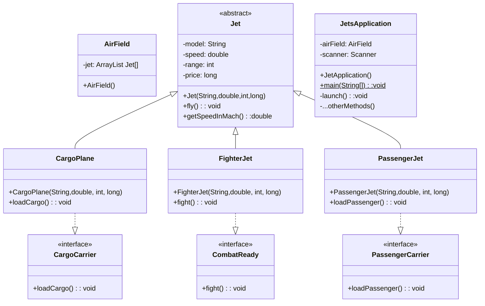

# JetsProject

### Description
This project applies many techniques in using `ArrayList`, `abstract` classes, `concrete` classes and interface in a simple simulation of airfield management. In this project, `Jet` is an abstract class spanning 3 concrete class `CargoPlane`, `FighterJet`, and `PassengerJet`. Each concrete aircraft class implement its own interface. The relationship of these classes is described in the following class diagram:

<em>Figure 1: JetsProject diagram.</em>

Class `AirField` is instantiated with 5 aircrafts from all three concrete classes. Class `JetsApplication` contains the `main()` method for user interaction. Users can interact with the app by:
1. List fleet
2. Fly all jets
3. View fastest jet
4. View jet with longest range
5. Load all Cargo Jets
6. Dogfight!
7. Load all Passenger Jets
8. Add a jet to Fleet
9. Remove a jet from Fleet
10. Quit

Each functionality is implemented by separated methods accessing and manipulating elements in an `ArrayList`. The user experience are implemented so that
- User inputs are validated to avoid unexpected exceptions that can cause program to crash.
- The big menu does not re-appear after each choice to save screen resource, however, users can choose to view the menu any time by pressing ? or /.
- User can change their mind on every steps of adding/ removing jets.

In adding a jet (option 8), the user is prompted with a sub menu specify the aircraft type to add:
1. Cargo AirCraft
2. Fighter AirCraft
3. Passenger Aircraft
4. Return to main menu
When in this sub-menu, user can select the type of aircraft to add the the fleet. Once type is selected, user will be prompted to input the aircraft model, speed, range, and price. At any time in the process, user can choose to opt out by entering "cancel". When appropriate, user can type ? to return to the main menu within the sub menu context.

In removing a jet (option 9), the user is presented with a list of jet to remove. The jet are dynamically numbered according to the length of the list at the time of querying thank to the implementation of `ArrayList` in the `AirField` class. The program can properly handle the case when there is no aircraft on the field.

I invite you to download and experience this mini-program.

### Tech Used
This project makes use of vanilla Java together with fundamental object-oriented concepts: abstraction, polymorphism,  inheritance, and encapsulation. The projects demonstrates the flexible of `ArrayList` datatype when using with abstract classes, concrete classes, and interfaces.  the project also employs Java exceptions to check for valid input, and implements smooth user experience process where the users have proper instructions on how to interact with the program without too many details fed in or too much information left out. Users will have a feeling of control when interacting with the program.    

### Limitations
I have tried to generalize the tasks into each method. However, there are some methods with many code repetitions. There are also some methods that handle too many things, which makes them hard to be reusable in different context. The code is open for refactoring.
  
### Lessons Learned
Object-Oriented-Programming (OOP) is a big concept including four main principles: abstraction, polymorphism, inheritance, and encapsulation. Java implement objects, data and functionality by organizing the codes into classes, fields, and methods. Java classes are classified as concrete, abstract, and final concrete. A class can inherits from another non-final class and can implements many interfaces. `ArrrayList` and generic types greatly enhance the flexibility of Java to model complex structure of real-world objects.

